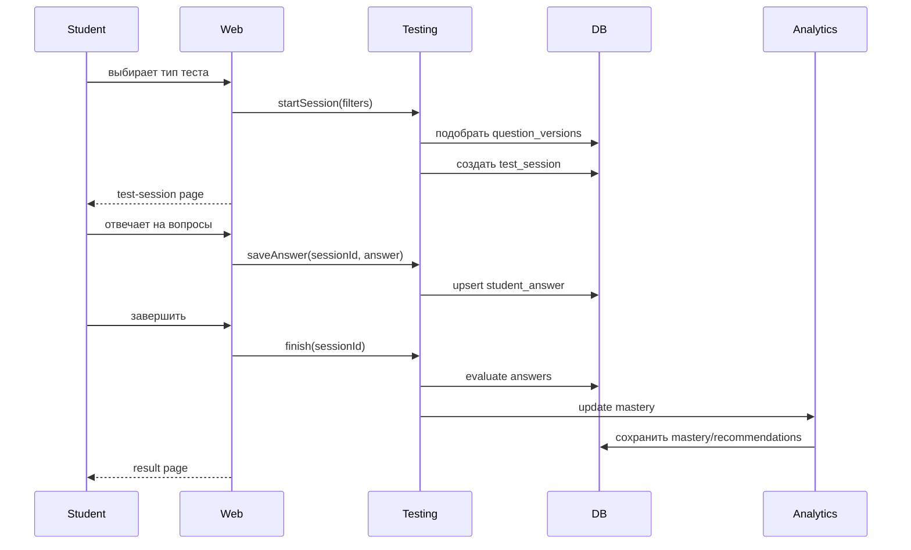
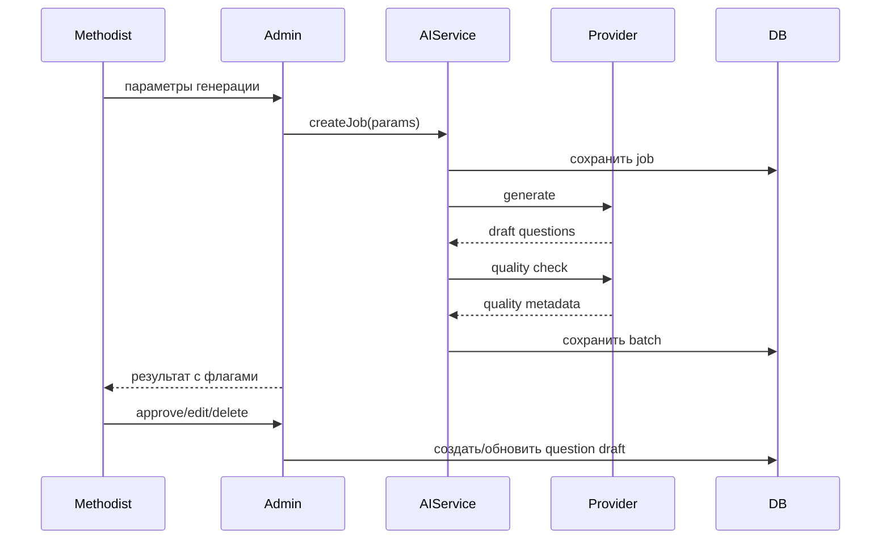
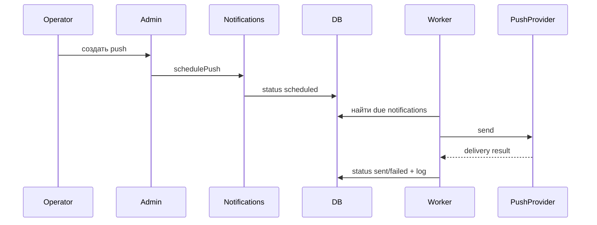

# Damulab.kz: архитектурное видение

Статус: ориентир для реализации.
Дата подготовки: 23 апреля 2026.

Архитектура намеренно простая на этапе MVP: один надежный backend-монолит, PostgreSQL как источник истины, серверный рендеринг для основных экранов, минимум клиентской сложности, отдельные адаптеры для AI, push и real-time викторин.
В дальнейшем, стоит учесть, фронтент может быть выделен в отдельное React-приложение, поэтому стоит явно отделять логику для более плавного и безболезненного перехода.


## 1. Архитектурные принципы

1. Сначала модульный монолит, не микросервисы.
2. PostgreSQL - основной источник истины.
3. Проверка ответов и бизнес-правила - только на сервере.
4. Серверный рендеринг для админки, родителя и большинства ученических страниц.
5. Легкая интерактивность на клиенте только там, где она нужна: тестовый плеер, matching, модалки, quiz room.
6. AI, push и real-time должны быть заменяемыми адаптерами, а не размазанной логикой внутри контроллеров.
7. Каждая AI-операция и админская публикация должна быть аудируемой.
8. Система должна работать приемлемо на слабых устройствах и медленной сети.
9. Промпты для LLM должны получаться единым способом, а не быть размазанными по коду. Допускается хранение Промптов в БД для исключения проблем с экранированием и подобными кейсами
10. На этапе MVP не делаем подтверждение при регистрации через email. В последующих релизах отправка писем будет реализована обязательно, как для отправки подтверждения регистрации или функционала восстановления пароля, так и для разнообразных рассылок.

## 2. Рекомендуемый стек

### Backend

- Java 21.
- Spring Boot 3.x.
- Spring MVC + Thymeleaf.
- Spring Security.
- Spring Validation.
- Spring Data JPA.
- Flyway.
- WebSocket/STOMP только для Arena/quiz live-сценариев.
- Scheduler: Spring Scheduler для MVP, Quartz при необходимости более строгих гарантий.

### Frontend

- Thymeleaf templates.
- Tailwind CSS или compiled CSS на базе текущих макетов.
- Alpine.js или небольшие vanilla JS modules для интерактивности.
- KaTeX для формул.
- Quill или другой проверенный editor для лекций.
- PWA-манифест и service worker на этапе, когда потребуется web push/offline.

### Data

- PostgreSQL.
- Redis опционально для quiz presence, rate limiting и короткоживущих кодов, но не как обязательная зависимость MVP.
- Object storage: локальное хранилище в dev, S3-compatible/MinIO в production для вложений лекций.

### AI

- Провайдер через интерфейс `AiProvider`.
- Стоит заложить сразу конфигурирование используемых AI-моделей: OpenAI как основной провайдер, DeepSeek как запасной и более дешевый вариант.
- Первая production-интеграция должна включаться отдельно через server-side config/feature flag после проверки доступности, стоимости и требований к данным.
- Все AI-запросы проходят через backend, ключи не попадают в клиент.

### Push

- DB-backed outbox + scheduled worker.
- Внешний provider через `PushProvider`.
- Для PWA: Web Push/FCM.
- Для нативного mobile: FCM/APNs через тот же доменный слой.

### Deployment

- Docker image приложения.
- PostgreSQL.
- Nginx/Reverse proxy.
- HTTPS termination.
- Backup PostgreSQL.
- Separate configs через environment variables.

## 3. Высокоуровневая схема

```mermaid
flowchart LR
  "Browser/PWA" --> "Spring Boot Web"
  "Admin Browser" --> "Spring Boot Web"
  "Spring Boot Web" --> "Application Services"
  "Application Services" --> "PostgreSQL"
  "Application Services" --> "Object Storage"
  "Application Services" --> "AI Provider Adapter"
  "Application Services" --> "Push Provider Adapter"
  "Quiz WebSocket" --> "Quiz Service"
  "Quiz Service" --> "PostgreSQL"
  "Scheduled Workers" --> "PostgreSQL"
  "Scheduled Workers" --> "Push Provider Adapter"
```

## 4. Модульный монолит

Рекомендуемые backend-пакеты:

```text
kz.damulab
  auth
  users
  parentlink
  content
  questions
  lectures
  testing
  analytics
  gamification
  quiz
  notifications
  ai
  admin
  audit
  common
```

Правило зависимостей:

- `auth` и `users` не зависят от бизнес-модулей.
- `content` является базой для `questions`, `lectures`, `testing`, `analytics`.
- `testing` пишет события/результаты, `analytics` читает и агрегирует.
- `ai` не знает UI; он возвращает доменные черновики и quality metadata.
- `notifications` не знает деталей UI, только target screen и payload.
- `admin` содержит web/controllers для админки, но бизнес-логика остается в сервисах модулей.

## 5. Слои приложения

### Web layer

Содержит:

- Thymeleaf controllers.
- REST controllers для динамических операций.
- WebSocket endpoints для quiz.
- DTO request/response.
- Form objects.

Не содержит:

- Проверку ответов.
- Расчет mastery.
- AI-промптинг.
- Прямую работу с push-provider.

### Application service layer

Содержит use cases:

- `StartTestSessionUseCase`.
- `SubmitAnswerUseCase`.
- `FinishTestSessionUseCase`.
- `GenerateQuestionsUseCase`.
- `ApproveQuestionUseCase`.
- `SchedulePushUseCase`.
- `LinkChildUseCase`.

### Domain layer

Содержит:

- Доменные сущности.
- Value objects.
- State transitions.
- Бизнес-валидации, которые не зависят от веба.

### Infrastructure layer

Содержит:

- JPA repositories.
- AI adapters.
- Push adapters.
- File storage.
- Scheduler jobs.
- Email adapters.

## 6. Данные и модель хранения

### Основные группы таблиц

- Identity: users, roles, profiles.
- Parent links: parent_student_links, link_codes.
- Content graph: subjects, grades, topics, atomic_skills.
- Questions: questions, question_versions, options, matching pairs, fill blank rules.
- Lectures: lectures, lecture_versions, attachments, checkpoints.
- Testing: test_templates, test_sessions, session_questions, student_answers, evaluations, results.
- Analytics: skill_mastery, recommendations, spaced_repetition_items.
- Game: achievements, student_achievements, streaks.
- Quiz: quiz_rooms, participants, rounds, answers, results.
- AI: ai_jobs, prompts, generated_batches, quality_checks.
- Notifications: push_notifications, delivery_logs, device_tokens.
- Audit: audit_logs, admin_action_logs.

### Версионирование вопросов

Вопрос как логический объект и версия как опубликованное состояние должны быть разделены.

Причина:

- Старые результаты должны ссылаться на конкретную версию вопроса.
- Методист может исправить вопрос без изменения истории.
- Content health должен понимать, какая версия была проблемной.

Минимальная модель:

```text
question
  id
  current_version_id
  status
  created_by

question_version
  id
  question_id
  version_no
  language
  body
  answer_key
  explanation
  topic_id
  skill_id
  difficulty
  source
  published_at
```

### Test session model

Сессия должна фиксировать набор вопросов на момент старта.

Причина:

- Нельзя менять состав теста во время прохождения.
- Результат должен быть воспроизводимым.
- Версии вопросов должны быть стабильными.

Минимальная модель:

```text
test_session
  id
  student_id
  test_type
  status
  started_at
  finished_at
  time_limit_seconds
  settings_json

test_session_question
  id
  session_id
  question_version_id
  order_no
  points

student_answer
  id
  session_question_id
  answer_json
  answered_at

answer_evaluation
  id
  session_question_id
  is_correct
  points_awarded
  details_json
```

## 7. Ключевые потоки

### 7.1. Прохождение теста



### 7.2. AI-генерация вопроса



### 7.3. Push-уведомление



## 8. UI-архитектура

### 8.1. Layouts

Нужны четыре layout-группы:

- Public layout: лендинг, вход, регистрация.
- Student layout: дашборд, тесты, аналитика, викторины, профиль.
- Parent layout: дашборд родителя.
- Admin layout: sidebar, таблицы, формы, статусы.

### 8.2. Компоненты

Обязательные reusable components:

- Language switch.
- Achievements modal.
- Admin sidebar.
- Page header.
- Card.
- Status badge.
- Form error block.
- Confirmation modal.
- Question renderer.
- Result navigation.
- Push preview.

### 8.3. JavaScript

Подход:

- Vanilla JS/Alpine для простых интеракций.
- Отдельные JS modules по страницам.
- WebSocket client только для quiz.
- Никакой логики правильных ответов на клиенте до завершения теста.

Page modules:

- `student-test-session.js`
- `student-test-result.js`
- `parent-home.js`
- `question-create-manual.js`
- `lecture-editor.js`
- `push-notifications.js`
- `quiz-room.js`

## 9. AI-архитектура

### 9.1. Интерфейсы

```java
public interface AiProvider {
    AiResponse generate(AiRequest request);
}

public interface AiPromptBuilder {
    AiRequest buildQuestionGenerationRequest(QuestionGenerationParams params);
    AiRequest buildQualityCheckRequest(GeneratedQuestionBatch batch);
    AiRequest buildExplanationRequest(QuestionContext context);
}
```

### 9.2. Правила

- Prompt templates хранятся версионированно.
- В AI request не отправляются лишние персональные данные ученика.
- Для персонального разбора ошибки отправляется минимальный контекст: текст вопроса, ответ ученика, правильный ответ, тема, возрастной уровень.
- AI output всегда проходит schema validation.
- Некорректный output сохраняется как failed или needs_manual_review.

### 9.3. Human-in-the-loop

AI может:

- Сгенерировать черновик вопроса.
- Предложить перевод.
- Предложить distractors.
- Предложить мини-лекцию.
- Предложить разбор ошибки.

AI не может без методиста:

- Опубликовать вопрос.
- Изменить официальный банк.
- Удалить контент.
- Изменить результаты ученика.

## 10. Testing Engine

### 10.1. Проверка ответов

`AnswerChecker` должен иметь отдельные стратегии:

- `SingleChoiceChecker`
- `MultipleChoiceChecker`
- `MatchingChecker`
- `FillInChecker`

Требования:

- Все checker-стратегии покрыты unit-тестами.
- Поддерживается частичный балл для MCQ только если это явно включено в настройках вопроса.
- Fill-in поддерживает exact match, normalized match, numeric tolerance и regexp.

### 10.2. Подбор вопросов

Первая версия алгоритма:

- Фильтр по предмету, классу, языку, статусу published.
- Вес по слабым темам ученика.
- Вес по сложности.
- Исключение недавно использованных вопросов, если есть достаточный запас.
- Фиксация выбранных question_version_id в session.

### 10.3. Mastery formula

На первом этапе достаточно простой формулы:

```text
new_mastery = old_mastery * 0.7 + attempt_score * difficulty_weight * 0.3
```

Дополнительно:

- Ошибка по простому вопросу снижает mastery сильнее.
- Верный ответ по сложному вопросу повышает mastery сильнее.
- Старые попытки постепенно теряют вес.

## 11. Notifications

### 11.1. Хранение времени

Правило:

- В БД хранить `scheduled_at_utc`.
- В UI показывать серверную timezone и локализованное отображение.
- Ввод оператора явно интерпретировать по выбранному правилу сервера.

### 11.2. Outbox-подход

Push worker:

- Берет due notifications со статусом `scheduled`.
- Ставит lock или переводит в `processing`.
- Отправляет provider-у.
- Записывает delivery log.
- Ставит `sent` или `failed`.

Это защищает от двойной отправки при рестарте.

## 12. Security

### 12.1. Доступы

- Student видит только свои данные.
- Parent видит только связанных детей.
- Methodist управляет контентом.
- Operator управляет push и техническими очередями.
- Admin управляет ролями и всеми справочниками.

### 12.2. Данные детей

- Минимизировать персональные данные.
- Не отправлять персональные данные в AI без необходимости.
- Хранить audit доступа к чувствительным админским операциям.
- Предусмотреть удаление/деактивацию профиля по регламенту.

### 12.3. Web security

- CSRF для форм.
- XSS sanitation для rich text лекций.
- Rate limiting на login и link-code.
- Secure cookies.
- Проверка ownership в каждом service method.

## 13. Observability

Логировать:

- Auth события высокого уровня.
- Start/finish test session.
- AI job lifecycle.
- Push lifecycle.
- Admin publish/archive actions.
- Ошибки external providers.

Метрики:

- Количество завершенных тестов.
- Среднее время теста.
- Ошибки сохранения ответов.
- AI success/failure rate.
- Push sent/failed rate.
- Slow endpoints.

Алерты:

- Push worker не работает.
- AI failure rate выше порога.
- Ошибки DB migration.
- Резкий рост 5xx.

## 14. Deployment и окружения

### Local

- App.
- PostgreSQL.
- Seed data.
- Mock AI provider.
- Mock push provider.

### Staging

- Production-like PostgreSQL.
- Реальный или sandbox push provider.
- Ограниченный AI provider.
- Тестовые пользователи.

### Production

- App behind Nginx.
- PostgreSQL with backups.
- Object storage.
- HTTPS.
- Secrets через environment/secret manager.
- Monitoring.

## 15. Backup и миграции

Требования:

- Flyway для схемы.
- Регулярный backup PostgreSQL.
- Отдельный backup uploaded attachments.
- Миграции должны быть backward-safe, когда возможно.
- Перед массовым импортом вопросов создавать import job и сохранять исходный файл.

## 16. Масштабирование

Первый предел масштабирования:

- Один app instance + PostgreSQL.
- Sticky sessions не требуются, если session хранится в БД или cookie.

Следующий шаг:

- Несколько app instances.
- Redis для WebSocket presence и коротких кодов.
- Quartz clustered scheduler или отдельный worker.
- Read replicas для аналитики, если потребуется.

Не делать заранее:

- Kafka.
- Отдельные микросервисы.
- Сложную ML-инфраструктуру.
- GraphQL без явной необходимости.

## 17. Архитектурное ревью и открытые решения

### 17.1. Подтвержденные решения

- Модульный монолит достаточен для первой реализации.
- PostgreSQL должен быть основной БД.
- Вопросы должны версионироваться.
- Проверка ответов должна быть серверной.
- AI-контент должен проходить human review.
- Push лучше строить через DB-backed outbox.

### 17.2. Решения, которые нужно принять

- Thymeleaf + Alpine или Thymeleaf + HTMX для динамических форм админки.
- Реальный provider push и формат device token.
- Production timezone policy.
- Нужен ли Redis в MVP или можно отложить до Arena.
- Формат хранения rich text лекций: HTML после sanitation или Quill Delta + render.
- Договорные/юридические ограничения для OpenAI и DeepSeek перед включением real provider calls.

### Stage 11 quiz first slice

28 April 2026: Arena started as a separate `quiz` module in the Spring Boot monolith. The first slice uses DB-backed room state and server-rendered Thymeleaf pages. It reuses the question bank and `AnswerChecker`, so correct answers stay server-side until the room result exists. WebSocket/STOMP is still reserved for the next live-update slice and was not added as a global dependency in this first pass.

### Stage 12 content health/import

29 April 2026: Content health, JSON import, Excel `.xlsx` import and quality flags were added inside the existing `questions` module. Health reads testing results through `AnswerEvaluation -> TestSessionQuestion -> QuestionVersion`, so question quality is tied to the exact current version while preserving historical version references. Import creates `question_import_jobs` and `question_import_errors`, reuses `QuestionForm`/`QuestionBankService` validation, and forces imported content into `NEEDS_REVIEW`. `question_flags` records methodist/analytics/complaint signals without auto-publishing or auto-changing official content. Materialized health aggregates and object-storage retention for raw source files are deferred until volume or policy requires them.

### 17.3. Риски архитектуры

- Если quiz real-time начать строить раньше Testing Hub, команда уйдет в сложность без образовательного ядра.
- Если сделать отдельный SPA слишком рано, вырастет стоимость поддержки без явной пользы.
- Если не версионировать вопросы, статистика результатов станет недостоверной после первых правок.
- Если хранить правильные ответы на клиенте, тестовый модуль станет небезопасным.
- Если push хранить только как cron без outbox, возможны пропуски и двойные отправки.
